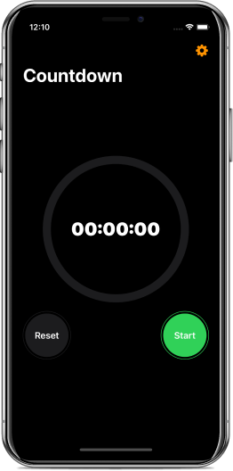
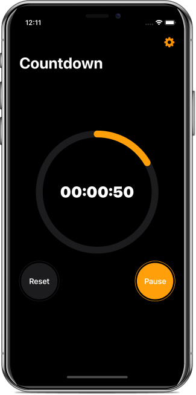
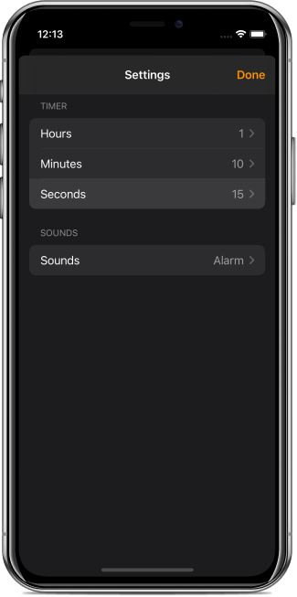

# Countdown

 

Set your countdown timer with optional alarm sounds and start, pause, and reset as you wish. The app is written in SwiftUI 2 and it is perfect for everyday activities such as cooking meals, taking quizzes, giving speeches, playing sports, or practicing music.

# Built With
[SwiftUI](https://developer.apple.com/xcode/swiftui/)

# Contributing

Contributions are what make the open source community such a fantastic place to learn, share, inspire, and create. Any contributions you make are greatly appreciated.

- Fork the project
- Create your feature branch `git checkout -b feature/AmazingFeature`
- Commit your changes `git commit -m 'Add some AmazingFeature'`
- Push to the branch `git push origin feature/AmazingFeature`
- Open a pull request

# License

See [LICENSE](LICENSE)

# Contact

Leonardo Bilia - [@leonardobilia](https://twitter.com/leonardobilia)